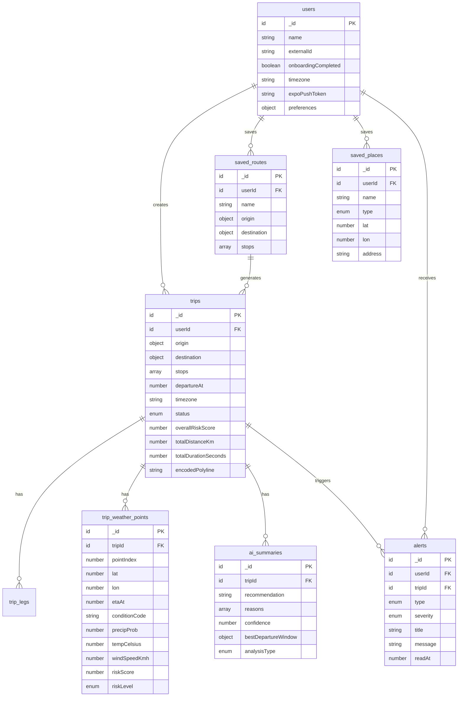
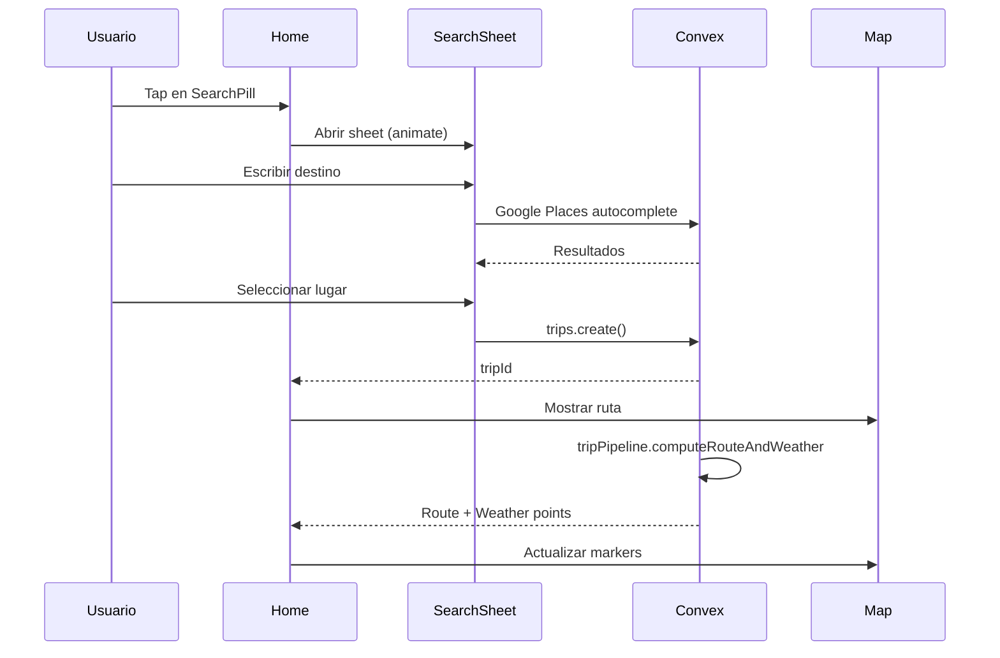
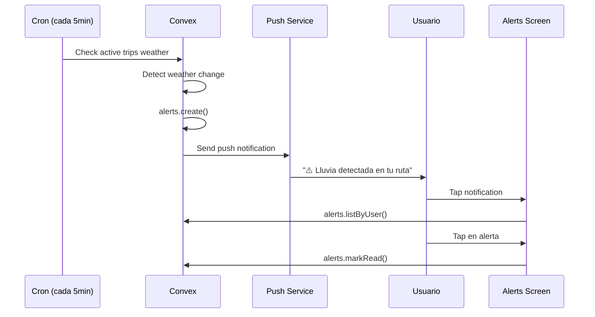
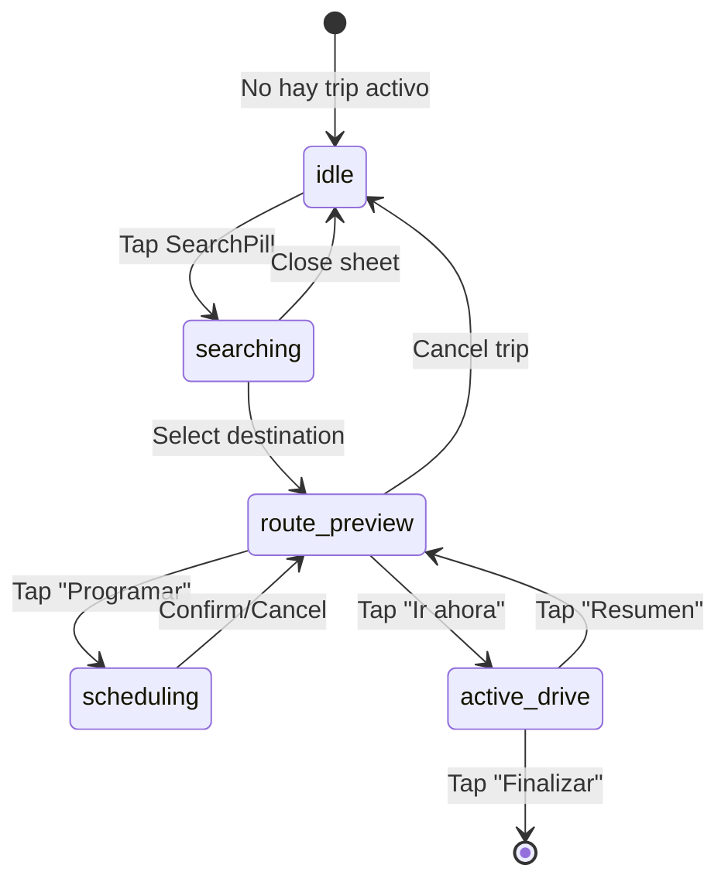
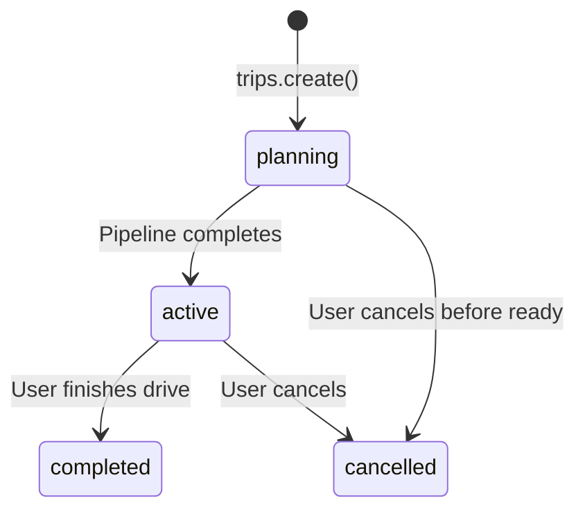

# Outia - Especificación Técnica de Pantallas

> Documentación técnica de las pantallas de la app Outia, basada en el modelo de datos de Convex y los diseños de Stitch.

**Fecha:** 2026-02-20
**Versión:** 2.0
**Proyecto Stitch:** `9836082934148142259`

---

## Tabla de Contenidos

1. [Visión General](#visión-general)
2. [Arquitectura de Datos](#arquitectura-de-datos)
3. [Design System](#design-system)
4. [Pantallas](#pantallas)
   - [1. Home (Map-First)](#1-home-map-first)
   - [2. Search Sheet](#2-search-sheet)
   - [3. Route Preview](#3-route-preview)
   - [4. Active Drive](#4-active-drive)
   - [5. Route Timeline](#5-route-timeline)
   - [6. Alerts](#6-alerts)
   - [7. Saved Routes](#7-saved-routes)
   - [8. Settings](#8-settings)
   - [9. Paywall](#9-paywall)
5. [Flujos de Usuario](#flujos-de-usuario)
6. [Estados de la App](#estados-de-la-app)

---

## Visión General

**Outia** es una aplicación de navegación que proporciona información meteorológica en tiempo real a lo largo de las rutas. Su propuesta de valor principal es ayudar a los conductores a:

1. **Planificar rutas seguras** con información de clima
2. **Recibir alertas proactivas** de condiciones adversas
3. **Optimizar horarios de salida** basados en pronósticos

### Principios de Diseño

- **Map-First**: El mapa es siempre el elemento principal
- **iOS 26 Liquid Glass**: Superficies translúcidas con blur sobre el mapa
- **Información Glanceable**: Datos importantes visibles de un vistazo
- **Acciones Contextuales**: Las opciones aparecen cuando son relevantes

---

## Arquitectura de Datos

### Modelo de Datos (Convex)



### Enums Clave

```typescript
// Status de viaje
type TripStatus = "planning" | "active" | "completed" | "cancelled";

// Niveles de riesgo
type RiskLevel = "low" | "moderate" | "high" | "extreme";

// Tipos de alerta
type AlertType = "high_risk" | "weather_change" | "departure_suggestion" | "rain_imminent" | "system";

// Severidad de alerta
type AlertSeverity = "info" | "warning" | "critical";

// Tipos de lugar guardado
type PlaceType = "home" | "work" | "custom";
```

---

## Design System

### Glass Tokens

```typescript
const glass = {
  surface: {
    primary: 'rgba(16, 22, 32, 0.34)',    // Headers, cards
    secondary: 'rgba(16, 22, 32, 0.24)',   // Chips, badges
    tertiary: 'rgba(16, 22, 32, 0.14)',    // Tab bar
    sheet: 'rgba(18, 24, 34, 0.76)',       // Bottom sheets
  },
  border: {
    light: 'rgba(255, 255, 255, 0.20)',
    medium: 'rgba(255, 255, 255, 0.28)',
  },
  text: {
    primary: '#FFFFFF',
    secondary: 'rgba(255, 255, 255, 0.70)',
    tertiary: 'rgba(255, 255, 255, 0.50)',
  },
  blur: {
    L1: 14,  // Tertiary surfaces
    L2: 24,  // Headers, chips
    L3: 34,  // Modals, sheets
  },
  radius: {
    sm: 8,
    md: 14,
    lg: 20,
    sheetTop: 12,
    pill: 100,
  },
};
```

### Risk Colors

```typescript
const riskColors = {
  low: '#22C55E',       // Verde
  moderate: '#F59E0B',  // Amarillo/Naranja
  high: '#F97316',      // Naranja
  extreme: '#EF4444',   // Rojo
};
```

### Iconos (SF Symbols)

| Acción | SF Symbol |
|--------|-----------|
| Búsqueda | `magnifyingglass` |
| Configuración | `gearshape` |
| Alertas | `bell` |
| Guardados | `bookmark` |
| Navegación | `location.north.fill` |
| Tiempo | `drop.fill`, `cloud.fill`, `thermometer.medium`, `wind` |
| Reloj | `clock` |
| Más opciones | `ellipsis` |

---

## Pantallas

### 1. Home (Map-First)

**Ruta:** `/(app)/home`
**Stitch Preview:** [Ver diseño](https://lh3.googleusercontent.com/aida/AOfcidXZBHnDvcxlMnCiMvdWoEvBjhDBS4ksqTG3trr4TqQBPwTGGws_TO0A9v7FnFXZxdv17501Xn68VCfacZEIWes8R-8tuibs0IerrDfR6uLDEY2tx7YVB8Fm-Jaz-5CLKHfM2IIf2i5vFjxQYwR8epft3LmEtAMfpPN9X1THt2pNvnoufNAyKTJ7MQKejFEq-sMUP8zGYMqB_akmkGIMXOutm0Kw64dWB9gl2lhXlNIwLKnfBVz_aidQ3d8)

#### Layout

```
┌─────────────────────────────────────┐
│                    [⚙️] [🔔] [🔖]   │ ← FABs (top-right)
│                                     │
│                                     │
│          [ MAPA FULLSCREEN ]        │
│                                     │
│                                     │
│  ┌─────────────────────────────┐   │
│  │  🔍 ¿A dónde vamos?         │   │ ← Search Pill (bottom)
│  └─────────────────────────────┘   │
└─────────────────────────────────────┘
```

#### Componentes

| Componente | Descripción | Props |
|------------|-------------|-------|
| `RouteMap` | Mapa de Mapbox a pantalla completa | `fullScreen`, `followsUserLocation` |
| `GlassSearchPill` | Botón de búsqueda con liquid glass | `onPress` |
| `FloatingFabs` | Stack vertical de FABs | `mode="nav"`, callbacks |

#### Estados

| Estado | Descripción | Componentes visibles |
|--------|-------------|----------------------|
| `idle` | Sin ruta activa | Map + SearchPill + FABs |
| `searching` | Sheet de búsqueda abierto | Map + SearchSheet |
| `route_preview` | Ruta calculada, sin navegación | Map + Route + KPIs + ActionBar |
| `scheduling` | Seleccionando hora de salida | Map + DatePicker overlay |
| `comparing_routes` | Comparando rutas alternativas | Map + Routes + ComparisonStrip |

#### API Calls

```typescript
// Al montar
const activeTrips = useQuery(api.trips.listActive);
const user = useQuery(api.users.current);

// Al crear ruta
const createTrip = useMutation(api.trips.create);

// Al cancelar
const cancelTrip = useMutation(api.trips.cancel);
```

#### Comportamientos

1. **Permisos de ubicación**: Solicitar al montar si no están concedidos
2. **Ruta activa**: Si existe `activeTrips[0]`, mostrar automáticamente en el mapa
3. **Tap en SearchPill**: Abrir `ExpandableSearchSheet` con animación
4. **FAB Alertas**: Badge con `unreadCount` si > 0

---

### 2. Search Sheet

**Componente:** `ExpandableSearchSheet`
**Stitch Preview:** [Ver diseño](https://lh3.googleusercontent.com/aida/AOfcidXQ5bEzG2sgyWcNKfbhXcP-1GUEY8MsB7YrkM5IBwK_FbGnPYgtZpe8fNb_vSoltGQatJvbCItgIGsRkSrY6_54d_Cyiaz_8W-hI70zTimBYCmLlsdnd0c1-vBWIkLACH6CzQWkVfbQZt7KSj8dVPGXAk31DG2oX11DDnn5WF2uaSDVT8O1CRvNxkJeHn4jYnRBQ_qBPzSAG5PyJ8Cfy0RTj6L3iOXa0qFQEJrnbmmQ-RN8WsBMray-VUU)

#### Layout

```
┌─────────────────────────────────────┐
│          [ MAPA (dimmed) ]          │
│                                     │
├─────────────────────────────────────┤
│  ═══════════════════════════════    │ ← Grabber
│                                     │
│  ┌─────────────────────────────┐   │
│  │ 🔵 Tu ubicación             │   │ ← Origin row
│  │ │                           │   │
│  │ 🔴 Buscar destino...  |     │   │ ← Destination input (focused)
│  └─────────────────────────────┘   │
│                                     │
│  Recientes                          │
│  ┌─────────────────────────────┐   │
│  │ 🕐 Oficina Central          │   │
│  │    Av. Insurgentes Sur 1234 │   │
│  ├─────────────────────────────┤   │
│  │ 🕐 Casa                     │   │
│  │    Col. Roma Norte          │   │
│  └─────────────────────────────┘   │
└─────────────────────────────────────┘
```

#### Componentes

| Componente | Descripción |
|------------|-------------|
| `BottomSheet` | Sheet de @gorhom/bottom-sheet |
| `GlassSheetBackground` | Fondo con liquid glass |
| `RouteSearchCard` | Card From/To con inputs |
| `RecentPlacesList` | Lista de lugares recientes |
| `PlaceSearchInput` | Input con autocomplete de Google Places |

#### Props

```typescript
interface ExpandableSearchSheetProps {
  visible: boolean;
  onClose: () => void;
  onSelectDestination: (place: PlaceResult) => void;
  onSelectOrigin?: (place: PlaceResult) => void;
  originLabel?: string;
}
```

#### Snap Points

- Inicial: `380px` (muestra From/To + 2-3 recientes)
- Expandido: `85%` (para resultados de búsqueda)

#### Comportamientos

1. **Auto-focus**: El input de destino se enfoca automáticamente al abrir
2. **Intercambiar origen/destino**: Botón de swap en el RouteSearchCard
3. **Selección de reciente**: Tap → cierra sheet → crea ruta
4. **Swipe down**: Cierra el sheet
5. **Teclado**: Expande el sheet al aparecer, colapsa al desaparecer

---

### 3. Route Preview

**Estado de Home cuando:** `trip.status === "active" && !navigating`
**Stitch Preview:** [Ver diseño](https://lh3.googleusercontent.com/aida/AOfcidXRAzFH4nmVA3NHuFwcEdRL_9cbOb65L18vsYqEokt4D7E71wKzawcE_wQnrEALR3tixBd7GIkiJ998u_I2Mfynn84E4PNISThBFWzVkTzmAt7weMNBsmHS-6Y3Qmoq9Oh7Ii93Y8-XS3tar72_PUnMd_qo-ezgIwDCnr_wX6OK5A8bqyg5EM1nnbSOZywEjv8sQa9SIX8KlOIPSvfghCsnjo51U2CbYyrqgk-64ybqnQJGEFPKLh09ngM)

#### Layout

```
┌─────────────────────────────────────┐
│  [Lluvia][Nubes][Temp][Viento]      │ ← Weather chips (horizontal scroll)
│                    ┌───────┐        │
│                    │ 45 km │        │ ← KPI Strip (glass)
│                    │ 52min │        │
│                    └───────┘        │
│                    [⚙️] [🔔] [🔖]   │ ← FABs
│                                     │
│      [ MAPA CON RUTA Y MARKERS ]    │
│          🟢    🟡    🔴             │ ← Weather markers on route
│                                     │
│  ┌───────┐ ┌─────────────┐ ┌───┐   │
│  │Timeline│ │  Ir ahora ▶ │ │...│   │ ← Action Bar
│  └───────┘ └─────────────┘ └───┘   │
└─────────────────────────────────────┘
```

#### Componentes Adicionales

| Componente | Descripción | Datos |
|------------|-------------|-------|
| `RouteKpiStrip` | Chip con distancia y ETA | `trip.totalDistanceKm`, `trip.totalDurationSeconds` |
| `WeatherLayerChips` | Toggle de capas de clima | `precipitation`, `clouds`, `temp`, `wind` |
| `RouteActionBar` | Barra de acciones inferior | 3 botones |
| `WeatherMarker` | Marcadores de clima en ruta | `weatherPoints[]` |

#### Weather Markers

Los markers se posicionan a lo largo de la polyline con colores según `riskLevel`:

```typescript
interface WeatherMarker {
  lat: number;
  lon: number;
  riskLevel: "low" | "moderate" | "high" | "extreme";
  conditionCode: string;  // "clear", "rain", "snow", etc.
}
```

#### Action Bar Acciones

| Botón | Acción | Resultado |
|-------|--------|-----------|
| Timeline | `router.push(\`/(app)/route/\${tripId}\`)` | Navega a timeline detallado |
| Ir ahora | `router.push(\`/(app)/drive/\${tripId}\`)` | Inicia navegación activa |
| Más (...) | ActionSheet con opciones | Nueva búsqueda, Programar, Compartir, Cancelar |

#### API Calls

```typescript
// Obtener trip completo con weather points
const trip = useQuery(api.trips.get, { tripId });

// Actualizar hora de salida
const updateDeparture = useMutation(api.trips.updateDeparture);
```

---

### 4. Active Drive

**Ruta:** `/(app)/drive/[tripId]`
**Stitch Preview:** Pantalla de conducción activa (en proceso)

#### Layout

```
┌─────────────────────────────────────┐
│ ┌─────────────────────────────────┐ │
│ │      ↱ Gira a la derecha       │ │ ← Turn banner (glass)
│ │        en 850 m                 │ │
│ │      Av. Insurgentes Sur        │ │
│ └─────────────────────────────────┘ │
│                        [🧭] [📍]    │ ← Compass + Recenter
│                                     │
│     [ MAPA EN MODO NAVEGACIÓN ]     │
│              ▲                      │ ← User location (direction)
│                                     │
│ ┌─────────────────────────────────┐ │
│ │ ETA 11:42  │  23 min  │  18 km  │ │ ← Info panel
│ │ ⚠️ Lluvia ligera en 5 km        │ │ ← Weather alert chip
│ │ 67 km/h            [80]         │ │ ← Speed + limit
│ └─────────────────────────────────┘ │
│                                     │
│ [Resumen]              [Finalizar]  │ ← Action buttons
└─────────────────────────────────────┘
```

#### Componentes

| Componente | Descripción |
|------------|-------------|
| `TurnBanner` | Instrucción de próximo giro (liquid glass, alta opacidad) |
| `NavigationInfoPanel` | Panel inferior con ETA, tiempo restante, distancia |
| `SpeedIndicator` | Velocidad actual vs límite |
| `WeatherAlertChip` | Alerta de clima próximo (si aplica) |
| `CompassButton` | Orientar mapa al norte |
| `RecenterButton` | Volver a seguir ubicación |

#### Estados del Mapa

| Estado | Comportamiento |
|--------|----------------|
| `following` | Mapa sigue al usuario, orientado en dirección de viaje |
| `free` | Usuario movió el mapa, mostrar botón de recentrar |
| `overview` | Vista general de la ruta (al tocar "Resumen") |

#### Actualizaciones en Tiempo Real

```typescript
// Poll cada 30s para weather updates
useEffect(() => {
  const interval = setInterval(() => {
    refetchTrip();
  }, 30000);
  return () => clearInterval(interval);
}, [tripId]);
```

#### Comportamientos

1. **Keep awake**: Mantener pantalla encendida durante navegación
2. **Background updates**: Continuar actualizando ubicación en background
3. **Alertas de voz** (opcional): Anunciar condiciones de clima
4. **Finalizar**: Confirmar con dialog, luego `trip.status = "completed"`

---

### 5. Route Timeline

**Ruta:** `/(app)/route/[tripId]`

#### Layout

```
┌─────────────────────────────────────┐
│ ← Timeline                          │ ← Header con back button
├─────────────────────────────────────┤
│ ┌─────────────────────────────────┐ │
│ │ 🤖 Resumen IA                    │ │ ← AI Summary Card
│ │ "Condiciones favorables. Lluvia │ │
│ │  ligera esperada entre km 25-32"│ │
│ │                                  │ │
│ │ Confianza: 85% │ Mejor hora: 3pm│ │
│ └─────────────────────────────────┘ │
│                                     │
│ ● Origen                    10:00   │ ← Timeline
│ │ 15 km • 18 min                    │
│ │ ☀️ Despejado • 24°C               │
│ │                                   │
│ ◐ Punto intermedio         10:18   │
│ │ 20 km • 25 min                    │
│ │ 🌧️ Lluvia ligera • 19°C          │
│ │ ⚠️ Riesgo moderado               │
│ │                                   │
│ ● Destino                  10:43   │
│   🌤️ Parcialmente nublado • 21°C   │
│                                     │
│ ┌─────────────────────────────────┐ │
│ │ 📅 Mejores horas para salir      │ │ ← Departure suggestion
│ │ 2:00 PM - 4:00 PM                │ │
│ │ Reduce riesgo en 35%             │ │
│ └─────────────────────────────────┘ │
└─────────────────────────────────────┘
```

#### Componentes

| Componente | Descripción | Datos |
|------------|-------------|-------|
| `AISummaryCard` | Resumen generado por IA | `aiSummary.recommendation`, `aiSummary.reasons` |
| `TripTimeline` | Timeline visual de la ruta | `trip.legs`, `weatherPoints` |
| `SegmentDetailCard` | Detalle de cada segmento | Weather + risk por segmento |
| `DepartureSuggestionCard` | Mejor hora para salir | `departureAnalysis.bestDepartureWindow` |

#### API Calls

```typescript
const trip = useQuery(api.trips.get, { tripId });
// trip incluye: legs, weatherPoints, aiSummary, departureAnalysis
```

---

### 6. Alerts

**Ruta:** `/(app)/alerts`
**Stitch Preview:** [Ver diseño](https://lh3.googleusercontent.com/aida/AOfcidU5T4NcgsCqaYVVJMhh_brJfv-dVefHASjSRzRnl2ubun_xExgtAwLOx_aSeticeDDcOVZHPOtjVd1eWoj7cFUwB-IQsbBpDrhXXsL1T1eG1Zz2tVW2Rekb6Q6bWF83G1sQPOo4NF8ir12MxNH-H4Qz2EGm1fEB7Jm5dRIQ8GDIOCoO8KOz_i1G6k8Pd_oHzrHIPUsJ9gepYCp-zxqlfZhuko2mqZTbtoQ2Tc130iyKd9ui7esLolsVnUM)

#### Layout

```
┌─────────────────────────────────────┐
│ ← Alertas                           │
├─────────────────────────────────────┤
│ CRÍTICAS                            │
│ ┌─────────────────────────────────┐ │
│ │🔴│ ⛈️ Tormenta severa           │ │
│ │  │ Lluvia intensa y vientos     │ │
│ │  │ fuertes en tu ruta           │ │
│ │  │                    Hace 5 min│ │
│ └─────────────────────────────────┘ │
│                                     │
│ ADVERTENCIAS                        │
│ ┌─────────────────────────────────┐ │
│ │🟠│ 🌫️ Niebla densa              │ │
│ │  │ Visibilidad reducida km 15-22│ │
│ └─────────────────────────────────┘ │
│ ┌─────────────────────────────────┐ │
│ │🟠│ 💨 Viento lateral            │ │
│ │  │ Ráfagas de 45 km/h          │ │
│ └─────────────────────────────────┘ │
│                                     │
│ INFORMACIÓN                         │
│ ┌─────────────────────────────────┐ │
│ │🔵│ 🌧️ Lluvia ligera             │ │
│ │  │ Precipitaciones al final     │ │
│ └─────────────────────────────────┘ │
└─────────────────────────────────────┘
```

#### Agrupación por Severidad

```typescript
const groupedAlerts = useMemo(() => {
  const groups = { critical: [], warning: [], info: [] };
  alerts.forEach(alert => {
    groups[alert.severity === 'critical' ? 'critical' :
           alert.severity === 'warning' ? 'warning' : 'info'].push(alert);
  });
  return groups;
}, [alerts]);
```

#### Componentes

| Componente | Descripción |
|------------|-------------|
| `AlertGroupHeader` | Header de sección ("CRÍTICAS", "ADVERTENCIAS", "INFO") |
| `AlertCard` | Card individual con borde de color por severidad |

#### AlertCard Props

```typescript
interface AlertCardProps {
  alert: {
    _id: Id<"alerts">;
    type: AlertType;
    severity: AlertSeverity;
    title: string;
    message: string;
    readAt?: number;
    tripId?: Id<"trips">;
    _creationTime: number;
  };
  onPress: () => void;
  onMarkRead: () => void;
}
```

#### API Calls

```typescript
const alerts = useQuery(api.alerts.listByUser);
const unreadCount = useQuery(api.alerts.unreadCount);
const markRead = useMutation(api.alerts.markRead);
const markAllRead = useMutation(api.alerts.markAllRead);
```

#### Comportamientos

1. **Pull to refresh**: Recargar alertas
2. **Tap en alerta**: Si tiene `tripId`, navegar a route timeline
3. **Swipe para marcar leída**: Deslizar a la derecha
4. **Badge en header**: "Marcar todas como leídas" si hay no leídas

---

### 7. Saved Routes

**Ruta:** `/(app)/saved-routes`

#### Layout

```
┌─────────────────────────────────────┐
│ ← Rutas Guardadas                   │
├─────────────────────────────────────┤
│ ┌─────────────────────────────────┐ │
│ │ Casa → Oficina                  │ │
│ │ Última vez: Hace 2 días         │ │
│ │                          [▶️] [⋯]│ │
│ └─────────────────────────────────┘ │
│                                     │
│ ┌─────────────────────────────────┐ │
│ │ Casa → Gimnasio                 │ │
│ │ Última vez: Hace 1 semana       │ │
│ │                          [▶️] [⋯]│ │
│ └─────────────────────────────────┘ │
│                                     │
│           Estado vacío:             │
│     "No tienes rutas guardadas"     │
│  [Crear primera ruta desde Home]    │
└─────────────────────────────────────┘
```

#### API Calls

```typescript
const savedRoutes = useQuery(api.savedRoutes.list);
const createTrip = useMutation(api.trips.create);
const removeRoute = useMutation(api.savedRoutes.remove);
const markUsed = useMutation(api.savedRoutes.markUsed);
```

#### Acciones por Ruta

| Acción | Descripción |
|--------|-------------|
| Tap | Crear trip con esa ruta |
| Play button | Crear trip y navegar directo |
| More (...) | Renombrar, Eliminar |

---

### 8. Settings

**Ruta:** `/(app)/settings`
**Stitch Preview:** [Ver diseño](https://lh3.googleusercontent.com/aida/AOfcidU50nE3-QhMpnjU5rGYnVlbIc6Sxyjrs5XG_56mj2hQ-9AKlUkwcdOD0jZUXESC9QYCB4oaNw0kJsetUO8cM9q_36NYD_jsoivLd4yJPUByd6UXhBRftnufEE5ClFxjvEqP7K0iY5Z53FZ4QYgUdOuqnJpy1enAeTeU_Micf7ijwVYo2fHcCy8Hm85eSWf9mz8MblHu3S-TL4cn2VWuQ8IEB4af_bmz4iMS2fqQ1yik0cPS0NZngzZ8WgY)

#### Secciones

```typescript
const settingsSections = [
  {
    title: "Cuenta",
    items: [
      { type: "profile", label: "Perfil", value: user.name },
      { type: "subscription", label: "Suscripción", value: "Premium" },
    ]
  },
  {
    title: "Preferencias",
    items: [
      { type: "picker", key: "units", label: "Unidades", options: ["Kilómetros", "Millas"] },
      { type: "toggle", key: "notificationsEnabled", label: "Notificaciones" },
      { type: "toggle", key: "showAirQuality", label: "Mostrar calidad del aire" },
    ]
  },
  {
    title: "Ruta",
    items: [
      { type: "toggle", key: "avoidTolls", label: "Evitar peajes" },
      { type: "toggle", key: "avoidHighways", label: "Evitar autopistas" },
    ]
  },
  {
    title: "Información",
    items: [
      { type: "info", label: "Versión", value: "1.2.0" },
      { type: "link", label: "Términos y condiciones", href: "/terms" },
      { type: "link", label: "Política de privacidad", href: "/privacy" },
      { type: "action", label: "Cerrar sesión", destructive: true },
    ]
  }
];
```

#### API Calls

```typescript
const user = useQuery(api.users.current);
const updatePreferences = useMutation(api.users.updatePreferences);
```

---

### 9. Paywall

**Ruta:** `/(app)/paywall`
**Stitch Preview:** Paywall (en proceso)

#### Layout

```
┌─────────────────────────────────────┐
│                                     │
│         [Logo Outia Premium]        │
│                                     │
│    "Viaja más seguro con alertas    │
│         en tiempo real"             │
│                                     │
│ ┌─────────────────────────────────┐ │
│ │ ✓ Alertas de clima ilimitadas   │ │
│ │ ✓ Rutas alternativas            │ │
│ │ ✓ Notificaciones de salida      │ │
│ │ ✓ Sin anuncios                  │ │
│ │ ✓ Soporte prioritario           │ │
│ └─────────────────────────────────┘ │
│                                     │
│ ┌──────────┐  ┌──────────────────┐ │
│ │ $4.99    │  │ $29.99/año       │ │
│ │ /mes     │  │ POPULAR          │ │ ← Selected
│ └──────────┘  └──────────────────┘ │
│                                     │
│ ┌─────────────────────────────────┐ │
│ │   Comenzar prueba gratis        │ │ ← CTA (solid blue)
│ └─────────────────────────────────┘ │
│    7 días gratis, luego $29.99/año  │
│                                     │
│   Restaurar compra                  │
│   Continuar sin Premium             │
└─────────────────────────────────────┘
```

#### Integraciones

- **RevenueCat**: Para manejo de suscripciones
- **App Store / Play Store**: In-app purchases

#### Comportamientos

1. **Mostrar al completar onboarding** si no tiene suscripción
2. **"Continuar sin Premium"**: Llama `completeOnboarding()` y navega a Home
3. **Compra exitosa**: Llama `completeOnboarding()` y navega a Home
4. **Restaurar compra**: Para usuarios que reinstalaron

---

## Flujos de Usuario

### Flujo Principal: Crear Ruta



### Flujo: Alerta → Acción



---

## Estados de la App

### State Machine de Home



### Trip Status Flow



---

## Anexo: API Reference

### Queries

| Query | Args | Returns | Uso |
|-------|------|---------|-----|
| `users.current` | - | `User \| null` | Header, settings |
| `trips.listActive` | - | `Trip[]` | Home (check active) |
| `trips.get` | `{ tripId }` | `TripWithDetails` | Route preview, timeline |
| `alerts.listByUser` | - | `Alert[]` | Alerts screen |
| `alerts.unreadCount` | - | `number` | Badge en FAB |
| `savedRoutes.list` | - | `SavedRoute[]` | Saved routes screen |
| `savedPlaces.list` | - | `SavedPlace[]` | Search recents |

### Mutations

| Mutation | Args | Returns | Uso |
|----------|------|---------|-----|
| `trips.create` | `{ origin, destination, stops, departureAt, timezone }` | `tripId` | Crear nueva ruta |
| `trips.updateDeparture` | `{ tripId, departureAt }` | - | Cambiar hora de salida |
| `trips.cancel` | `{ tripId }` | - | Cancelar ruta |
| `alerts.markRead` | `{ alertId }` | - | Marcar alerta como leída |
| `alerts.markAllRead` | - | - | Marcar todas como leídas |
| `users.updatePreferences` | `{ preferences }` | - | Guardar settings |
| `users.completeOnboarding` | - | - | Completar onboarding |
| `savedRoutes.create` | `{ name, origin, destination, stops }` | `routeId` | Guardar ruta |
| `savedRoutes.remove` | `{ id }` | - | Eliminar ruta guardada |

---

*Documento generado para el equipo de desarrollo de Outia*
